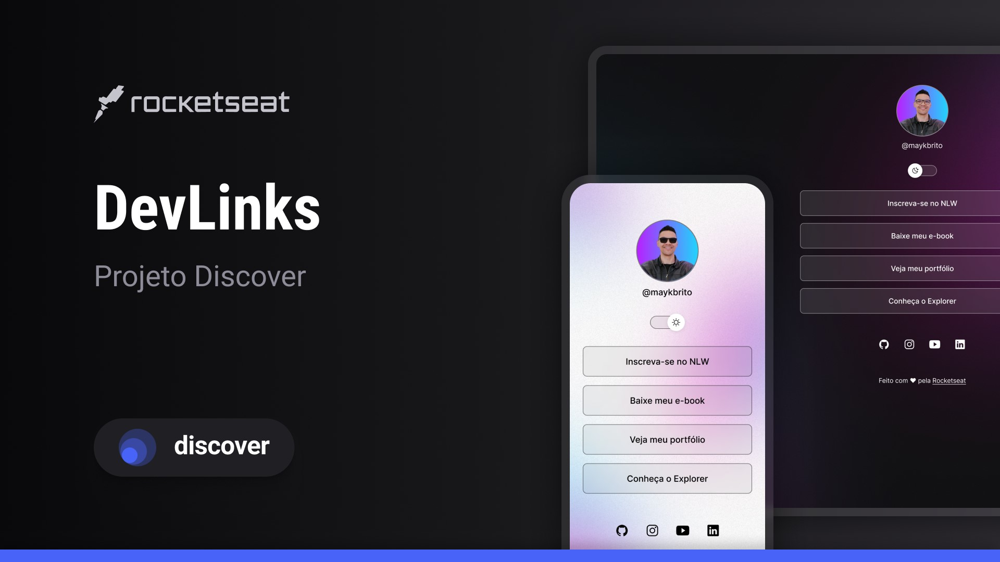

<h1 align="center">DevLinks</h1>

Programa exclusivo e gratuito, promovido pela Rocketseat para ensino de tecnologias WEB.

  <a href="#-tecnologias">Tecnologias</a>     |    
  <a href="#-projeto">Projeto</a>     |    
  <a href="#-layout">Layout</a>     |    
  <a href="#memo-licença">Licença</a>

  

 

  

##  🚀 Tecnologias

Esse projeto foi desenvolvido com as seguintes tecnologias:

- HTML e CSS
- JavaScript
- Git e Github
- Figma

##  💻 Projeto

 O DeveLinks é um agregador de links para usar como um cartão de visitas online.

##  🔖Layout

Você pode visualizar o layout do projeto através de [ DESSE LINK ](https://www.figma.com/file/9eabDyelC6UqO25VGeZJyY/DevLinks-%E2%80%A2-Projeto-Discover-(Community)?type=design&node-id=10-620&t=GPPVCowDLQYyUYOZ-0). É necessário ter conta no [ Figma ](https://figma.com) para acessá-lo.

## : memo : Licença 

Esse projeto está sob a licença MIT.

---

Feito com ♥ por Rocketseat : wave : [ Participe da nossa comunidade! ](https://discord.gg/rocketseat)# DevLinks  
